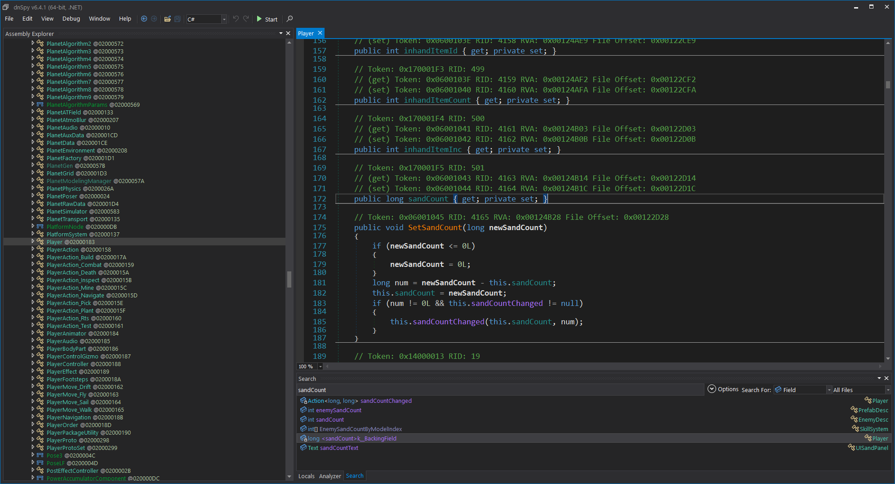

# DSP Mods

[InfiniteFoundations](./InfiniteFoundations/README.md)

## Dev notes

- [BepInEx ConfigFile](https://docs.bepinex.dev/articles/dev_guide/plugin_tutorial/4_configuration.html) class is an easy builtin way to save/read a mod config.
- [Patching (Harmony)](https://harmony.pardeike.net/articles/patching.html)
- [Patch annotations](https://harmony.pardeike.net/articles/annotations.html)
- [VisualStudio BepInEx setup guide](https://steamcommunity.com/sharedfiles/filedetails/?id=2106187116)
- [DSP modding wiki](https://dsp-wiki.com/Modding:Modding)
- Use [dnSpyEx](https://github.com/dnSpyEx/dnSpy) to decompile DSP (Assembly-CSharp.dll)
  
